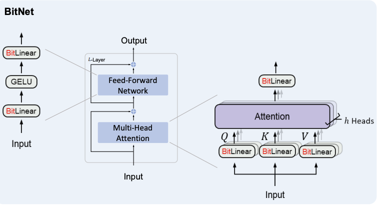

# 🚀 BitNet Deep Dive — Quantization & Systems Analysis

This project presents a detailed analysis of the BitNet architecture, focusing on its low-bit quantization techniques, hardware-aware optimizations, and efficient inference design.

🔗 **Reference Repository:**  
https://github.com/microsoft/BitNet

---

## 📌 Overview

BitNet is a neural network architecture designed for **extreme low-bit inference**, using:

- **1-bit / ternary weights** {-1, 0, +1}  
- **int8 activations**  
- **mixed-precision computation (int8 × int2)**  

The goal is to significantly reduce:

- memory usage  
- compute cost  
- energy consumption  

while maintaining competitive model accuracy.

---
## 🖼️ Architecture Diagram



📌 Recommended sources:
- BitNet paper: https://arxiv.org/pdf/2402.17764.pdf  
- Create your own using draw.io / Excalidraw  

---

## 🧠 Key Concepts

### 🔹 Ternary Quantization
Weights are compressed into:
{-1, 0, +1}

This reduces storage while preserving sign-based information.

---

### 🔹 Global Scaling (i2_scale)
- Single scale per tensor  
- Simplifies computation and memory layout  
- Effective because ternary quantization already limits precision  

---

### 🔹 Mixed Precision Design
- Activations → int8 (dynamic, precision-sensitive)  
- Weights → int2 (static, compressible)  
- Output → bfloat16 (numerical stability)  

---

### 🔹 Lookup Table (LUT) Optimization
- Replaces multiplications with lookup operations  
- Generated at runtime to:
  - reduce memory usage  
  - improve cache locality  

---

### 🔹 Hardware-Aware Kernels
- TL1 → ARM (NEON)  
- TL2 → x86 (AVX)  

Each kernel is optimized for:
- vector width  
- memory alignment  
- cache behavior  

---

## ⚙️ Architecture Flow

```
Input (float)
   ↓
Activation Quantization → int8
   ↓
Weights (ternary → packed int2)
   ↓
LUT Generation (runtime)
   ↓
Matrix Multiplication (int8 × int2)
   ↓
Accumulation
   ↓
Output → bfloat16
```

---


## 📂 Project Structure

Project 4 — BitNet Analysis

├── [Q1.md](./Q1%20.md)  → Global scaling i2_scale analysis  
├── [Q2.md](./Q2%20.md)  → Near-zero handling in quantization  
├── [Q3.md](./Q3.md)  → LUT generation vs precomputation  
├── [Q4.md](./Q4.md)  → ARM vs x86 kernel design  
├── [Q5.md](./Q5.md)  → Mixed precision int8 × int2 reasoning  
├── [Q6.md](./Q6.md)  → Bit packing strategy  
├── [Q7.md](./Q7.md)  → Parallel vs non-parallel execution  
└── [README.md](./README.md) → Project overview  

---

## 📊 Key Design Trade-offs

| Design Choice | Benefit | Trade-off |
|--------------|--------|----------|
| Ternary weights | Extreme compression | Loss of magnitude precision |
| Global scaling | Simplicity, speed | Less adaptability |
| Runtime LUT | Low memory usage | Extra computation |
| Mixed precision | Balanced accuracy | Increased complexity |
| Separate kernels | Maximum performance | Reduced portability |

---

## 🧩 Key Insights

- Data layout is critical for performance  
- Compression must align with computation  
- Memory vs compute trade-offs drive system design  
- Hardware-aware optimizations are essential  

---

## 📚 References

- BitNet Repository  
  https://github.com/microsoft/BitNet  

- Research Papers  
  - Jacob et al., 2018  
  - Dettmers et al., 2022  

---

## 🎯 Final Takeaway

Efficient AI systems depend not only on model design but also on how data is represented, compressed, and executed on hardware.

---

## 👨‍💻 Author

Siddhant Mathur
